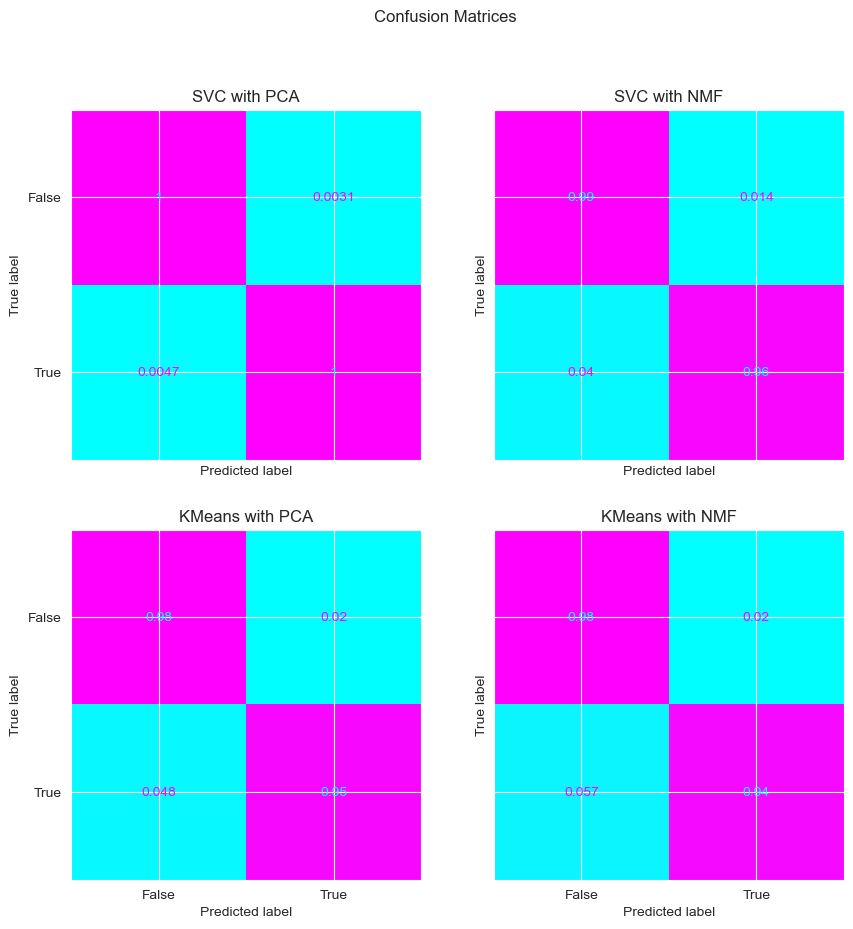
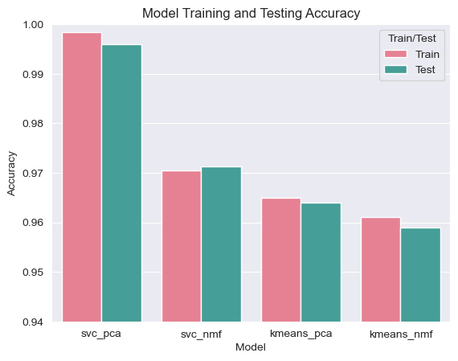
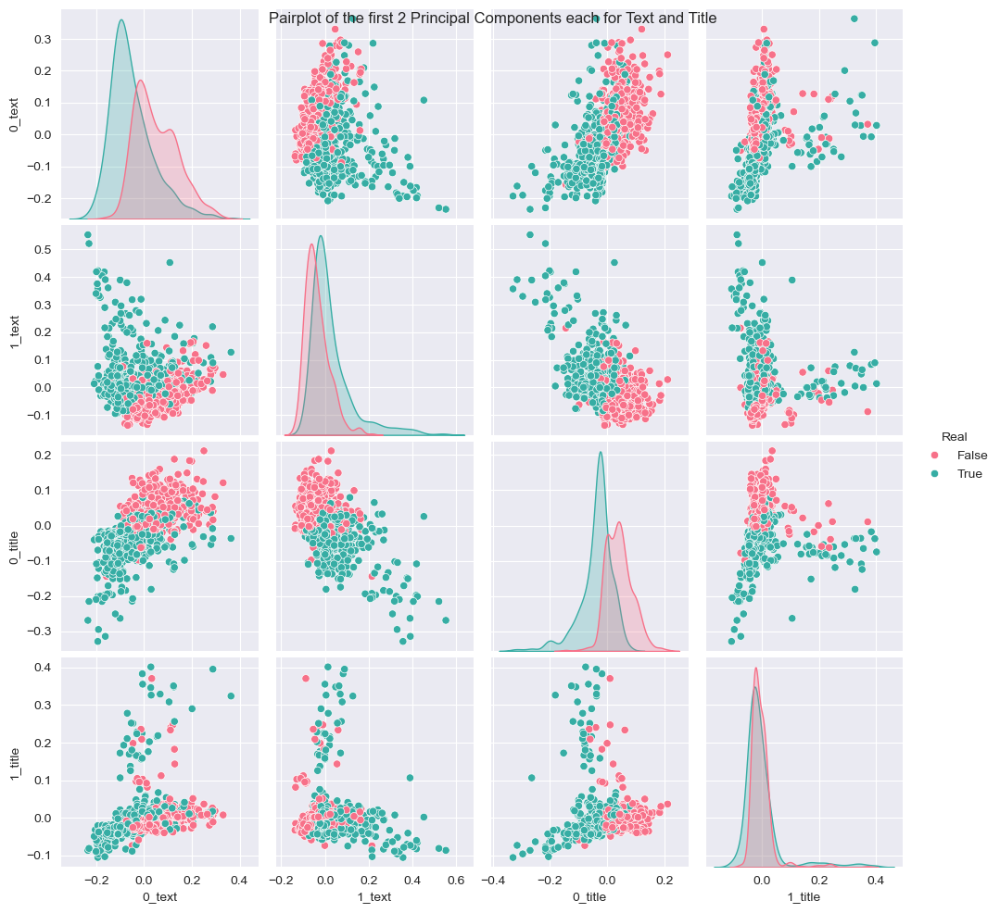

# Fake News Identification

**Comparing supervised and unsupervised learning for fake news detection — 99.6% test accuracy on ~40,000 news articles.**


Four end-to-end scikit-learn pipelines were trained to classify news articles as real or fake using the [ISOT Fake News Dataset](https://onlineacademiccommunity.uvic.ca/isot/wp-content/uploads/sites/7295/2023/02/ISOT_Fake_News_Dataset_ReadMe.pdf). Article titles and bodies are vectorized with TF-IDF, reduced with either **PCA** or **NMF**, and classified with either a **Support Vector Classifier** (supervised) or **K-Means clustering** (unsupervised) — a head-to-head comparison of how much labeled data actually buys you on this task.

The full analysis — EDA, preprocessing, model tuning, and discussion — lives in [`notebooks/report.ipynb`](notebooks/report.ipynb).

## Results

| Pipeline | Dimensionality Reduction | Classifier | Train Accuracy | Test Accuracy |
|---|---|---|---|---|
| **`svc_pca`** | PCA | SVC | 99.8% | **99.6%** |
| `svc_nmf` | NMF | SVC | 97.1% | 97.1% |
| `kmeans_pca` | PCA | K-Means (k=2) | 96.5% | 96.4% |
| `kmeans_nmf` | NMF | K-Means (k=2) | 96.1% | 95.9% |

<p align="center">
  
</p>

**Key takeaways:**

- The supervised SVC pipelines achieved a ~10× lower error rate than K-Means (0.4% vs. ~4%), as expected — SVMs excel at partitioning high-dimensional spaces like TF-IDF matrices.
- Even fully **unsupervised** K-Means clustering recovered the real/fake split with ~96% accuracy, showing the two classes are strongly separated in TF-IDF space.
- Dimensionality reduction was crucial for K-Means, which suffers from the curse of dimensionality: cross-validation selected just 8 NMF components for K-Means vs. 40 for the SVC.

<p align="center">
  
</p>

The classes separate visibly in just the first two principal components of the title and text vectors:

<p align="center">
  
</p>

## Methodology

**Data.** ~45,000 articles (21,417 real / 23,481 fake) from the ISOT dataset, also available on [Kaggle](https://www.kaggle.com/datasets/clmentbisaillon/fake-and-real-news-dataset). Both CSVs are included in [`data/`](data/). The classes are nearly balanced.

**Cleaning.** A custom `Cleaner` transformer drops duplicated titles/texts, rows with scraped junk in the date field, and "stub" articles whose body is shorter than their own title (~7,500 rows removed).

**Feature engineering.** Titles and bodies are vectorized separately with TF-IDF (top 10,000 terms, English stop words removed) and concatenated with a `ColumnTransformer`. The package also includes spaCy-based `Tokenizer`/`Filter`/`Lemmatizer` transformers that merge named entities into single tokens (e.g. `White_House`), built during exploration.

**Models.** Each of the four pipelines (PCA/NMF × SVC/K-Means) was tuned with `GridSearchCV` over vectorizer casing, component counts, and model hyperparameters, using 50/50 train/test splits. Since K-Means cluster indices are arbitrary, a custom `Predictor` estimator learns the best cluster-to-label mapping by scoring every permutation on the training set.

## Repository Structure

```
├── FakeNews/              # Python package: custom sklearn transformers
│   ├── Data.py            #   loads the ISOT CSVs into a labeled DataFrame
│   ├── Cleaner.py         #   drops duplicates, junk rows, and stubs
│   ├── Tokenizer.py       #   spaCy tokenization with entity merging
│   ├── Filter.py          #   removes punctuation/stop words/whitespace
│   ├── Lemmatizer.py      #   tokens back to vectorizable strings
│   └── Predictor.py       #   maps K-Means clusters to class labels
├── notebooks/
│   ├── report.ipynb       # main deliverable: full analysis and report
│   └── testing.ipynb      # exploratory scratch work
├── data/                  # ISOT dataset (True.csv, Fake.csv)
├── models/                # trained pipelines as .pkl files
├── reports/figures/       # key figures exported from the report
├── environment.yml        # conda environment
└── pyproject.toml         # makes the FakeNews package installable
```

## Getting Started

```bash
git clone https://github.com/chernobylx/Fake-News-Identification.git
cd Fake-News-Identification

conda env create -f environment.yml
conda activate fake-news
pip install -e .

jupyter lab notebooks/report.ipynb
```

### Using the trained models

The tuned pipelines are pickled in [`models/`](models/). They expect a DataFrame-like array with the ISOT columns (`title`, `text`, `subject`, `date`) and require this repo's `FakeNews` package on the path (installed above) plus scikit-learn 1.6:

```python
import pickle
from FakeNews.Data import Data

with open('models/svc_pca.pkl', 'rb') as f:
    model = pickle.load(f)

data = Data(path='data').load()
predictions = model.predict(data.X)   # True = real news, False = fake
```

## Limitations

These models separate this dataset's real and fake articles almost perfectly, but the ISOT corpus draws its real articles from a single outlet (Reuters), so some of that signal is likely source style rather than veracity. Generalization to unseen outlets, social media posts, satire, and deliberate disinformation is untested — see the Discussion section of the report for more.

## References

Full citations are in the [report notebook](notebooks/report.ipynb). Highlights:

- Ahmed, H., Traore, I., & Saad, S. — [Detection of Online Fake News Using N-Gram Analysis and Machine Learning Techniques](https://link.springer.com/chapter/10.1007/978-3-319-69155-8_9) (source of the ISOT dataset)
- [Fake news detection algorithms – A systematic literature review](https://www.sciencedirect.com/science/article/abs/pii/S0169023X25000369)

## About

Final project for *Unsupervised Algorithms in Machine Learning* — by Jonathan Chernoch. Released under the [MIT License](LICENSE).
